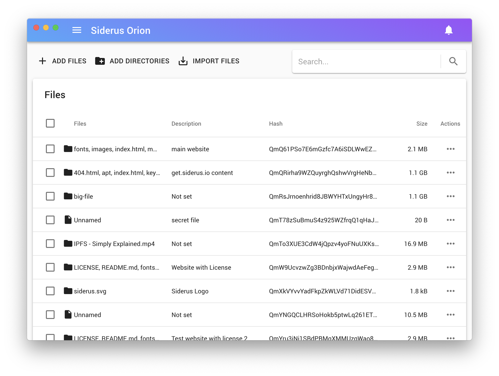

# Siderus Orion: Easy to use IPFS Desktop client

Siderus Orion is an easy to use [inter planetary file system](http://ipfs.io)
(aka IPFS) Desktop client. It helps sharing content on the public peer to peer
network without any command line or technical knowlede.
The app includes everything is needed to start your own personal IPFS node.

**Note**: This repository is used only to collect public user feedback, bug
reports and feature requests as [issues](https://github.com/siderus/orion/issues).
If you are looking for the source  code head over our
[GitLab repositories](https://gitlab.com/siderus/orion)!

Useful Links:

- Orion Repositories: [https://gitlab.com/siderus/orion](https://gitlab.com/siderus/orion)
- Orion Website: [https://orion.siderus.io/](https://orion.siderus.io/)
- Chat Room: [https://matrix.to/#/#siderus-orion:matrix.org](https://matrix.to/#/!NsSfDPEJrJyBUKogDd:matrix.org?via=matrix.org&via=swedneck.xyz&via=matrix.ordoevangelistarum.com&via=linuxgaming.life)
- What is IPFS: [https://ipfs.io](https://ipfs.io/) [video](https://www.youtube.com/watch?v=5Uj6uR3fp-U&utm_source=siderus)

## Download & Install

To download the latest version, you can [check the latest release page](https://orion.siderus.io/#/download)

We support the following operative systems, but feel free to try it on different ones:

- macOS (latest)
- Windows 10
- Ubuntu, Debian
- Fedora, RedHat
- Other GNU/Linux (AppImage)

## Join the community

This repository is used to collect Bug reports, feature requests and to provide basic support.

If you need to report something that can't be reported, please send an email to [hello@siderus.io](mailto:hello@siderus.io) or
contact us directly in the [decentralised chatroom](https://matrix.to/#/!NsSfDPEJrJyBUKogDd:matrix.org?via=matrix.org&via=swedneck.xyz&via=matrix.ordoevangelistarum.com&via=linuxgaming.life)!

## About Siderus

Orion is developed and maintained by [Siderus](https://siderus.io).
Subscribe to [our newsletter](http://eepurl.com/dfB6q5) to stay updated, or visit our [blog](https://blog.siderus.io) to know more.

