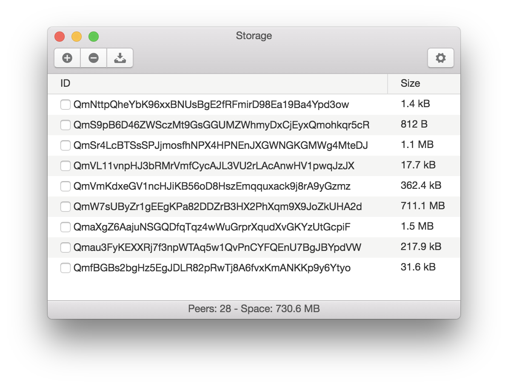

# Lumpy - Easy-to-Use and KISS desktop client for IPFS
Lumpy is an easy-to-use and KISS [IPFS](http://ipfs.io) desktop client, to add,
remove and manage the repository and the node info.



**Note**: This page and project is still work in progress!

## Goals and Feature
This app provides and easy to use and KISS client to IPFS for any OS.
The user should be able to manage the repository by pinning and unpinning,
adding and removing files from the node. The main goals are:

* explains and **educates** the user about the perks of using IPFS
* shows only what is **important** to the user (Sometimes the name of the
file/Directory, not hash. KISS, but configurable)
* Listen to KISS use cases for IPFS for common users, content publishers and
developers, like:
  * allows the user to easily **share and transfer** a file with another user
  * should integrate and work without problems to other IPFS clients/daemons
  * **encrypts** if requested when adding a new file/directory to increase privacy
and security

### Features:

* Manages easily the files in the repository (Not just objects)
* Integrates with OS actions like drag-and-drop or URI
* Provides information and statistics about the repository and the daemon
* Allows to maintain a daemon from the interface (gc)

## How To use and contribute

Note: This project is not ready for a stable use. Help is needed!
It is developed using *Electron* and *React*, but we have a lot of things to do!
You can contribute by checkign what should be done in the
[Trello Board](https://trello.com/b/Z1iOgLYc/lumpy-ipfs).

```bash
# Install dependencies
npm install
# Run the app
npm start
```

#### License [GPL 3](LICENSE.md)
